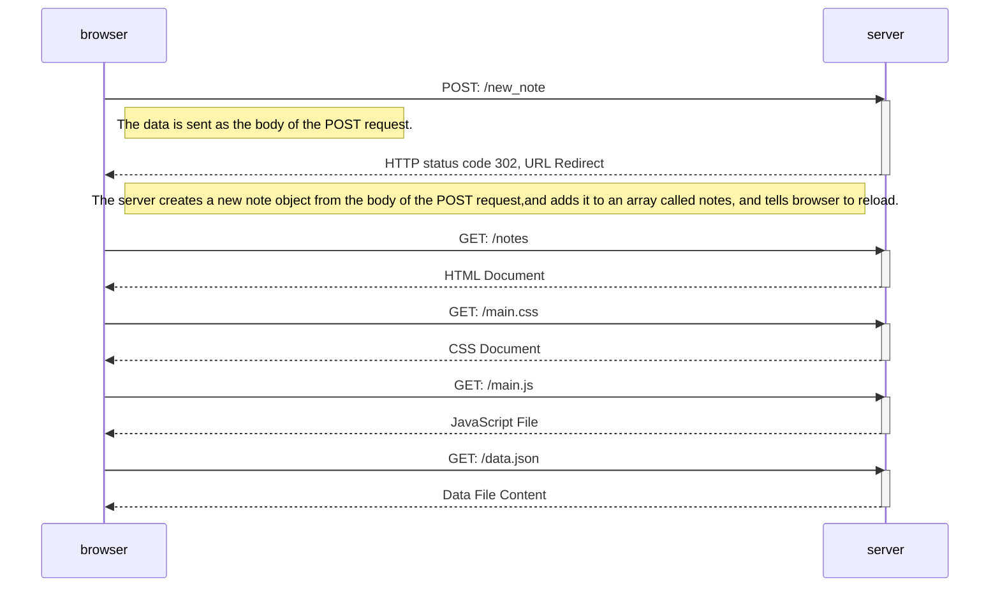

```mermaid
sequenceDiagram
    participant browser
    participant server

    browser->>server: POST: /new_note
    activate server

    Note right of browser: The data is sent as the body of the POST request.

    server-->>browser: HTTP status code 302, URL Redirect
    deactivate server

    Note right of browser: The server creates a new note object from the body of the POST request,and adds it to an array called notes, and tells browser to reload.

    browser->>server: GET: /notes
    activate server
    server-->>browser: HTML Document
    deactivate server

    browser->>server: GET: /main.css
    activate server
    server-->>browser: CSS Document
    deactivate server

    browser->>server: GET: /main.js
    activate server
    server-->>browser: JavaScript File
    deactivate server

    browser->>server: GET: /data.json
    activate server
    server-->>browser: Data File Content
    deactivate server

```
