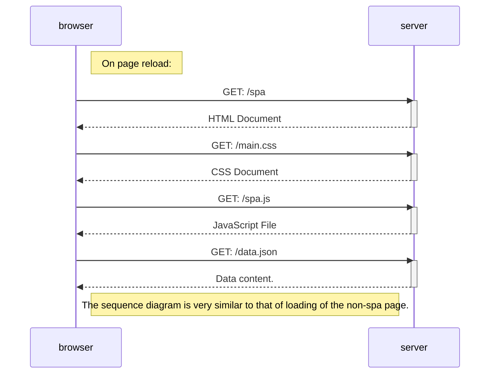

```mermaid

sequenceDiagram
    participant browser
    participant server

    Note right of browser: On page reload:

    browser->>server: GET: /spa
    activate server
    server-->>browser: HTML Document
    deactivate server

    browser->>server: GET: /main.css
    activate server
    server-->>browser: CSS Document
    deactivate server

    browser->>server: GET: /spa.js
    activate server
    server-->>browser: JavaScript File
    deactivate server

    browser->>server: GET: /data.json
    activate server
    server-->>browser: Data content.
    deactivate server

    Note right of browser: The sequence diagram is very similar to that of loading of the non-spa page.


```
