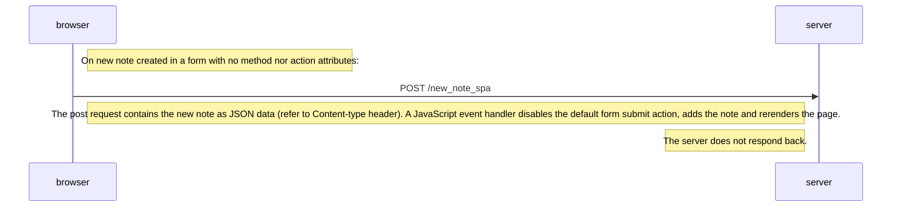

```mermaid

sequenceDiagram
    participant browser
    participant server

    Note right of browser: On new note created in a form with no method nor action attributes:

    browser->>server: POST /new_note_spa

    Note right of browser: The post request contains the new note as JSON data (refer to Content-type header). A JavaScript event handler disables the default form submit action, adds the note and rerenders the page.


    Note left of server: The server does not respond back.


```
