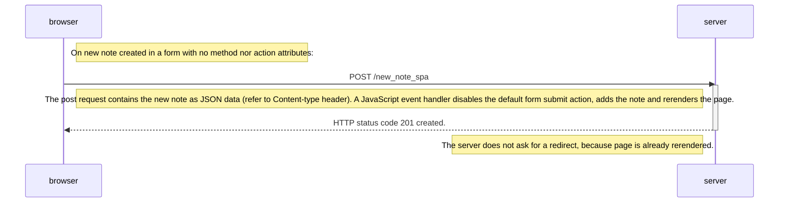

```mermaid

sequenceDiagram
    participant browser
    participant server

    Note right of browser: On new note created in a form with no method nor action attributes:

    browser->>server: POST /new_note_spa
    activate server

    Note right of browser: The post request contains the new note as JSON data (refer to Content-type header). A JavaScript event handler disables the default form submit action, adds the note and rerenders the page.

    server-->>browser: HTTP status code 201 created.
    deactivate server


    Note left of server: The server does not ask for a redirect, because page is already rerendered.


```
